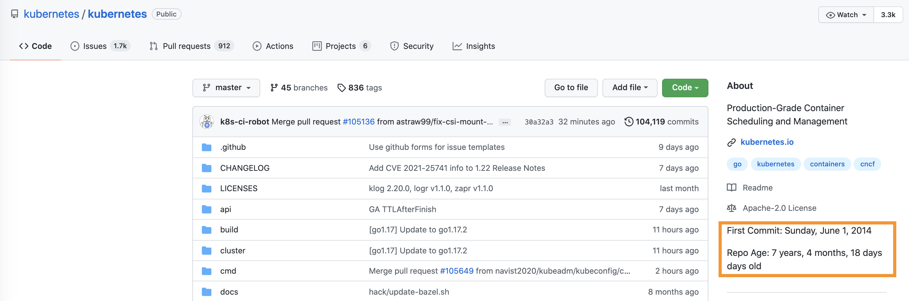

# repo-age-chrome-extension

This is a simple extension that adds shows a public Github repository first commit date and age. For example, below you can see Kubernetes first commit date and repo age.



To use, clone this repository to your computer.

```
$ git clone git@github.com:shekhargulati/git@github.com:shekhargulati/repo-age-chrome-extension.git
```

Install with these steps:

1. Go to the Chrome [extensions](chrome://extensions/) page.
2. Turn on *Developer mode* to enable loading *unpacked extensions*.
3. Add the extension by clicking *Load Unpacked* button, and select the source directory.

After the extension is added, when you go to any public Github repository you will see the first commit date and repository age.
